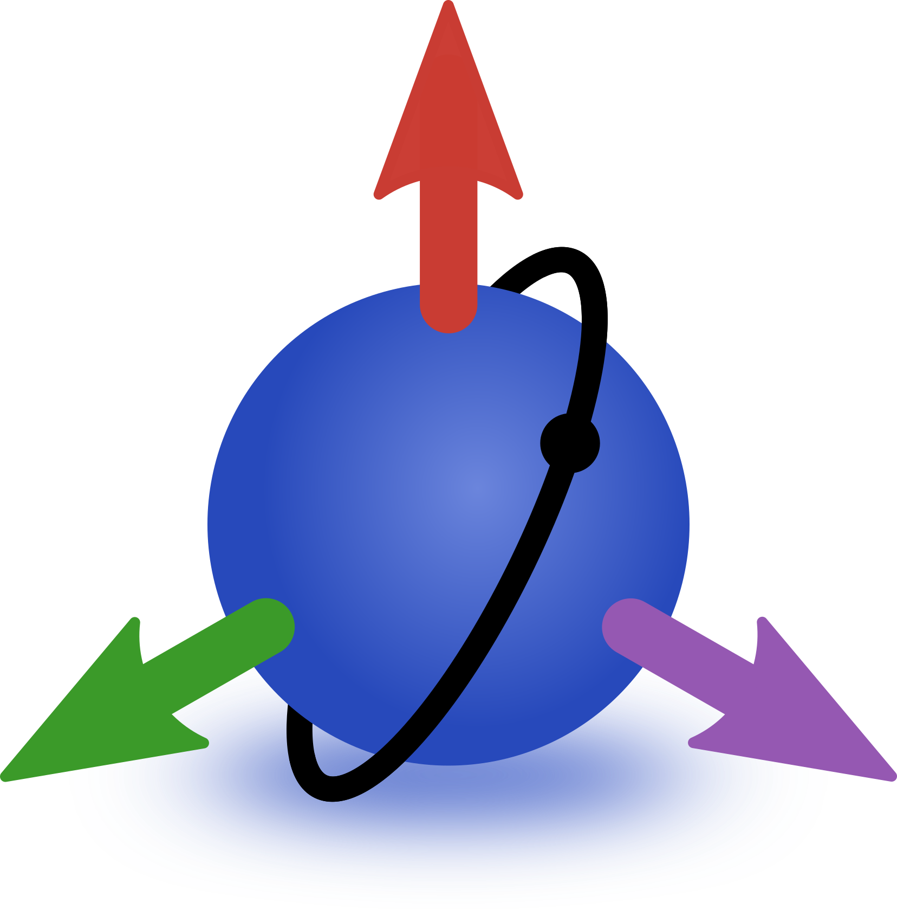

<p align="center">
  <br>
</p>

# SatelliteToolbox.jl

[](https://github.com/JuliaSpace/SatelliteToolbox.jl/actions/workflows/ci.yml)
[](https://codecov.io/gh/JuliaSpace/SatelliteToolbox.jl)
[][docs-stable-url]
[][docs-dev-url]
[](https://github.com/JuliaSpace/SatelliteToolbox.jl/blob/master/LICENSE.txt)
[](https://zenodo.org/doi/10.5281/zenodo.10396045)

The **SatelliteToolbox.jl** contains a set of packages with functions to perform analysis
and build simulations related to satellites. It is used on a daily basis on projects at the
[Brazilian National Institute for Space Research (INPE)](http://www.gov.br/inpe).

The set of packages are listed bellow. All of them are loaded and reexported in this one.

| Package Name                                                                   | Description                                            | Build Status                                          | Coverage                                               |
|--------------------------------------------------------------------------------|--------------------------------------------------------|-------------------------------------------------------|--------------------------------------------------------|
| [SatelliteToolboxAtmosphericModels.jl][SatelliteToolboxAtmosphericModels-link] | Atmospheric models                                     | ![Build status][SatelliteToolboxAtmosphericModels-ci] | ![Build status][SatelliteToolboxAtmosphericModels-cov] |
| [SatelliteToolboxBase.jl][SatelliteToolboxBase-link]                           | Base functions and type definitions                    | ![Build status][SatelliteToolboxBase-ci]              | ![Coverace][SatelliteToolboxBase-cov]                  |
| [SatelliteToolboxCelestialBodies.jl][SatelliteToolboxCelestialBodies-link]     | Celestial bodies                                       | ![Build status][SatelliteToolboxCelestialBodies-ci]   | ![Coverage][SatelliteToolboxCelestialBodies-cov]       |
| [SatelliteToolboxGeomagneticField.jl][SatelliteToolboxGeomagneticField-link]   | Geomagnetic field models                               | ![Build status][SatelliteToolboxGeomagneticField-ci]  | ![Coverage][SatelliteToolboxGeomagneticField-cov]      |
| [SatelliteToolboxGravityModels.jl][SatelliteToolboxGravityModels-link]         | Gravity models                                         | ![Build status][SatelliteToolboxGravityModels-ci]     | ![Coverage][SatelliteToolboxGravityModels-cov]         |
| [SatelliteToolboxLegendre.jl][SatelliteToolboxLegendre-link]                   | Legendre associated functions and its time-derivatives | ![Build status][SatelliteToolboxLegendre-ci]          | ![Coverage][SatelliteToolboxLegendre-cov]              |
| [SatelliteToolboxOrbitDataMessages.jl][SatelliteToolboxOrbitDataMessages-link] | Creating, fetching, and parsing orbit data messages    | ![Build status][SatelliteToolboxOrbitDataMessages-ci] | ![Coverage][SatelliteToolboxOrbitDataMessages-cov]     |
| [SatelliteToolboxPropagators.jl][SatelliteToolboxPropagators-link]             | Orbit propagators                                      | ![Build status][SatelliteToolboxPropagators-ci]       | ![Coverage][SatelliteToolboxPropagators-cov]           |
| [SatelliteToolboxSgp4.jl][SatelliteToolboxSgp4-link]                           | SGP4/SDP4 orbit propagator                             | ![Build status][SatelliteToolboxSgp4-ci]              | ![Coverage][SatelliteToolboxSgp4-cov]                  |
| [SatelliteToolboxTle.jl][SatelliteToolboxTle-link]                             | Creating, fetching, and parsing TLEs                   | ![Build status][SatelliteToolboxTle-ci]               | ![Coverage][SatelliteToolboxTle-cov]                   |
| [SatelliteToolboxTransformations.jl][SatelliteToolboxTransformations-link]     | Transformations (reference frames, time, etc.)         | ![Build status][SatelliteToolboxTransformations-ci]   | ![Coverage][SatelliteToolboxTransformations-cov]       |

## Installation

This package can be installed using:

```julia-repl
julia> using Pkg
julia> Pkg.add("SatelliteToolbox")
```

## Documentation

Please, see each package for the related documentation of the functions.

[docs-dev-url]: https://juliaspace.github.io/SatelliteToolbox.jl/dev
[docs-stable-url]: https://juliaspace.github.io/SatelliteToolbox.jl/stable
[SatelliteToolboxAtmosphericModels-link]: https://github.com/JuliaSpace/SatelliteToolboxAtmosphericModels.jl
[SatelliteToolboxAtmosphericModels-cov]: https://img.shields.io/codecov/c/github/JuliaSpace/SatelliteToolboxAtmosphericModels.jl?token=oQOhGnQmdG&style=flat-square&logo=codecov&logoColor=white&labelColor=475569
[SatelliteToolboxAtmosphericModels-ci]: https://img.shields.io/github/actions/workflow/status/JuliaSpace/SatelliteToolboxAtmosphericModels.jl/ci.yml?style=flat-square&logo=githubactions&logoColor=white&labelColor=475569&label=CI
[SatelliteToolboxBase-link]: https://github.com/JuliaSpace/SatelliteToolboxBase.jl
[SatelliteToolboxBase-cov]: https://img.shields.io/codecov/c/github/JuliaSpace/SatelliteToolboxBase.jl?token=YADU7IB8CT&style=flat-square&logo=codecov&logoColor=white&labelColor=475569
[SatelliteToolboxBase-ci]: https://img.shields.io/github/actions/workflow/status/JuliaSpace/SatelliteToolboxBase.jl/ci.yml?style=flat-square&logo=githubactions&logoColor=white&labelColor=475569&label=CI
[SatelliteToolboxCelestialBodies-link]: https://github.com/JuliaSpace/SatelliteToolboxCelestialBodies.jl
[SatelliteToolboxCelestialBodies-cov]: https://img.shields.io/codecov/c/github/JuliaSpace/SatelliteToolboxCelestialBodies.jl?token=CONQMSI4JD&style=flat-square&logo=codecov&logoColor=white&labelColor=475569
[SatelliteToolboxCelestialBodies-ci]: https://img.shields.io/github/actions/workflow/status/JuliaSpace/SatelliteToolboxCelestialBodies.jl/ci.yml?style=flat-square&logo=githubactions&logoColor=white&labelColor=475569&label=CI
[SatelliteToolboxGeomagneticField-link]: https://github.com/JuliaSpace/SatelliteToolboxGeomagneticField.jl
[SatelliteToolboxGeomagneticField-cov]: https://img.shields.io/codecov/c/github/JuliaSpace/SatelliteToolboxGeomagneticField.jl?token=HW2Y9NA0L5&style=flat-square&logo=codecov&logoColor=white&labelColor=475569
[SatelliteToolboxGeomagneticField-ci]: https://img.shields.io/github/actions/workflow/status/JuliaSpace/SatelliteToolboxGeomagneticField.jl/ci.yml?style=flat-square&logo=githubactions&logoColor=white&labelColor=475569&label=CI
[SatelliteToolboxGravityModels-link]: https://github.com/JuliaSpace/SatelliteToolboxGravityModels.jl
[SatelliteToolboxGravityModels-cov]: https://img.shields.io/codecov/c/github/JuliaSpace/SatelliteToolboxGravityModels.jl?token=47G4OLV6PD&style=flat-square&logo=codecov&logoColor=white&labelColor=475569
[SatelliteToolboxGravityModels-ci]: https://img.shields.io/github/actions/workflow/status/JuliaSpace/SatelliteToolboxGravityModels.jl/ci.yml?style=flat-square&logo=githubactions&logoColor=white&labelColor=475569&label=CI
[SatelliteToolboxLegendre-link]: https://github.com/JuliaSpace/SatelliteToolboxLegendre.jl
[SatelliteToolboxLegendre-cov]: https://img.shields.io/codecov/c/github/JuliaSpace/SatelliteToolboxLegendre.jl?token=AUE8ZZ5IXJ&style=flat-square&logo=codecov&logoColor=white&labelColor=475569
[SatelliteToolboxLegendre-ci]: https://img.shields.io/github/actions/workflow/status/JuliaSpace/SatelliteToolboxLegendre.jl/ci.yml?style=flat-square&logo=githubactions&logoColor=white&labelColor=475569&label=CI
[SatelliteToolboxOrbitDataMessages-link]: https://github.com/JuliaSpace/SatelliteToolboxOrbitDataMessages.jl
[SatelliteToolboxOrbitDataMessages-cov]: https://img.shields.io/codecov/c/github/JuliaSpace/SatelliteToolboxOrbitDataMessages.jl?token=IQMHCB4OB7&style=flat-square&logo=codecov&logoColor=white&labelColor=475569
[SatelliteToolboxOrbitDataMessages-ci]: https://img.shields.io/github/actions/workflow/status/JuliaSpace/SatelliteToolboxOrbitDataMessages.jl/ci.yml?style=flat-square&logo=githubactions&logoColor=white&labelColor=475569&label=CI
[SatelliteToolboxPropagators-link]: https://github.com/JuliaSpace/SatelliteToolboxPropagators.jl
[SatelliteToolboxPropagators-cov]: https://img.shields.io/codecov/c/github/JuliaSpace/SatelliteToolboxPropagators.jl?token=WSVR7QYKOD&style=flat-square&logo=codecov&logoColor=white&labelColor=475569
[SatelliteToolboxPropagators-ci]: https://img.shields.io/github/actions/workflow/status/JuliaSpace/SatelliteToolboxPropagators.jl/ci.yml?style=flat-square&logo=githubactions&logoColor=white&labelColor=475569&label=CI
[SatelliteToolboxSgp4-link]: https://github.com/JuliaSpace/SatelliteToolboxSgp4.jl
[SatelliteToolboxSgp4-cov]: https://img.shields.io/codecov/c/github/JuliaSpace/SatelliteToolboxSgp4.jl?token=480UYDX6H5&style=flat-square&logo=codecov&logoColor=white&labelColor=475569
[SatelliteToolboxSgp4-ci]: https://img.shields.io/github/actions/workflow/status/JuliaSpace/SatelliteToolboxSgp4.jl/ci.yml?style=flat-square&logo=githubactions&logoColor=white&labelColor=475569&label=CI
[SatelliteToolboxTle-link]: https://github.com/JuliaSpace/SatelliteToolboxTle.jl
[SatelliteToolboxTle-cov]: https://img.shields.io/codecov/c/github/JuliaSpace/SatelliteToolboxTle.jl?token=SPIKBIN3ES&style=flat-square&logo=codecov&logoColor=white&labelColor=475569
[SatelliteToolboxTle-ci]: https://img.shields.io/github/actions/workflow/status/JuliaSpace/SatelliteToolboxTle.jl/ci.yml?style=flat-square&logo=githubactions&logoColor=white&labelColor=475569&label=CI
[SatelliteToolboxTransformations-link]: https://github.com/JuliaSpace/SatelliteToolboxTransformations.jl
[SatelliteToolboxTransformations-cov]: https://img.shields.io/codecov/c/github/JuliaSpace/SatelliteToolboxTransformations.jl?token=SH31IN1JXM&style=flat-square&logo=codecov&logoColor=white&labelColor=475569
[SatelliteToolboxTransformations-ci]: https://img.shields.io/github/actions/workflow/status/JuliaSpace/SatelliteToolboxTransformations.jl/ci.yml?style=flat-square&logo=githubactions&logoColor=white&labelColor=475569&label=CI
