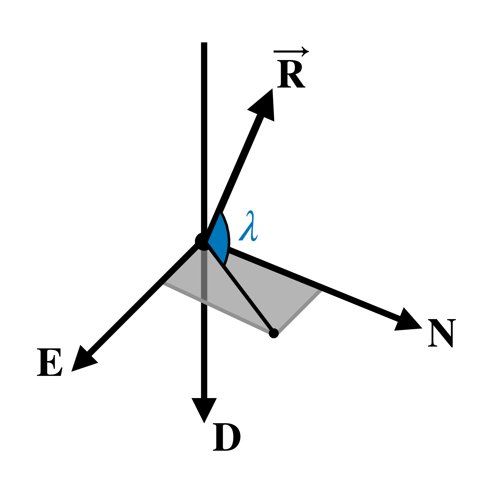

# ISS Observation Instants

In this tutorial, we will compute the instants in which we can theoretically observe the ISS
from our location. Actually, we will compute the moments an observer on the Earth's surface
has a direct line of sight to the ISS.

## Theory

We can verify if we have a line of sight to an object by computing the elevation ``\lambda``
of its position vector represented in a local reference frame. Let's use the NED
(North-East-Down) reference: its X axis points toward the North, its Y axis points toward
the East, and its Z axis points toward the Earth's center, as shown in the following figure.



If the angle ``\lambda`` is greater than zero, we can theoretically observe the object we
are analyzing because it is above the horizon at the desired location. We can compute this
angle using:

```math
\begin{equation*}
  \lambda = \arctan\left(-\frac{R_{NED,z}}{\sqrt{R_{NED,x}^2 + R_{NED,y}^2}}\right)~,
\end{equation*}
```

where ``R_{NED,i}`` is the ``i``-axis component of the object position vector ``\vec{R}``
represented in the NED reference frame.

## Algorithm

We need to perform the following tasks to check when ISS enters our field of view:

1. Obtain the ISS position during the desired period;
2. Convert the position vector to the NED reference frame;
3. Obtain the elevation for each instant; and
4. Check when the elevation is greater than zero.

## Code

Before starting, let's load all the packages in the **SatelliteToolbox.jl** ecosystem:

```julia-repl
julia> using SatelliteToolbox
```

We first need to obtain the mean elements of the ISS to propagate its orbit. Celestrak
distributes the general perturbation (GP) data of the cataloged objects using the Orbit
Mean-Elements Message (OMM) format, which is defined in the CCSDS Orbit Data Messages (ODM)
standard. The package
[SatelliteToolboxOrbitDataMessages.jl](https://github.com/JuliaSpace/SatelliteToolboxOrbitDataMessages.jl)
provides a fetcher to download those messages. The following code creates the fetcher and
downloads the latest available OMM of the ISS:

```julia-repl
julia> f = create_omm_fetcher(CelestrakOmmFetcher)
CelestrakOmmFetcher: https://celestrak.org/NORAD/elements/gp.php

julia> omms = fetch_omms(f; satellite_name = "ISS (ZARYA)")
1-element Vector{OrbitMeanElementsMessage}:
 OMM: ISS (ZARYA) [1998-067A] (Epoch = 2026-08-09T11:20:13.861824)

julia> iss_omm = omms[1]
OrbitMeanElementsMessage:
  Header
    Originator :
  Body
  └─ Segment
     ├─ Metadata
     │    Object Name         : ISS (ZARYA)
     │    Object ID           : 1998-067A
     │    Center Name         : EARTH
     │    Ref. Frame          : TEME
     │    Time System         : UTC
     │    Mean Element Theory : SGP4
     └─ Data
        ├─ Mean Keplerian Elements
        │    Epoch              : 2026-08-09T11:20:13.861824
        │    Mean Motion        : 15.49394423 rev/day
        │    Eccentricity       : 0.0007357
        │    Inclination        : 51.6322°
        │    RA of Asc. Node    : 36.3838°
        │    Arg. of Pericenter : 29.0181°
        │    Mean Anomaly       : 331.1215°
        └─ TLE Related Parameters
             Ephemeris Type      : 0
             Classification Type : U
             NORAD Cat ID        : 25544
             Element Set Number  : 999
             Rev at Epoch        : 58001
             Bstar               : 8.7174e-5
             ∂(Mean Motion)/∂t   : 4.421e-5 rev/day²
             ∂²(Mean Motion)/∂t² : 0.0 rev/day³
```

The mean elements in the fetched OMM are related to the SGP4 theory, as we can see in the
field `Mean Element Theory`. Hence, we must use the SGP4/SDP4 algorithm to propagate the ISS
orbit. This propagator is initialized using a TLE, and we can convert the OMM to it using
the function `convert`:

```julia-repl
julia> iss_tle = convert(TLE, iss_omm)
TLE:
                      Name : ISS (ZARYA)
          Satellite number : 25544
  International designator : 98067A
        Epoch (Year / Day) : 26 / 221.47238266 (2026-08-09T11:20:13.862)
        Element set number : 999
              Eccentricity :   0.00073570
               Inclination :  51.63220000 deg
                      RAAN :  36.38380000 deg
       Argument of perigee :  29.01810000 deg
              Mean anomaly : 331.12150000 deg
           Mean motion (n) :  15.49394423 revs / day
         Revolution number : 58001
                        B* :   8.7174e-05 1 / er
                     ṅ / 2 :    4.421e-05 rev / day²
                     n̈ / 6 :            0 rev / day³
```

Now, we can initialize the SGP4/SDP4 propagator as follows:

```julia-repl
julia> orbp = Propagators.init(Val(:SGP4), iss_tle)
OrbitPropagatorSgp4{Float64, Float64}:
   Propagator name : SGP4 Orbit Propagator
  Propagator epoch : 2026-08-09T11:20:13.862
  Last propagation : 2026-08-09T11:20:13.862
```

Let's say we want to check when the ISS will be inside our field of view within one day
from this OMM epoch. The following code propagates the mean elements for one day using a
step of one second:

```julia-repl
julia> ret = Propagators.propagate!.(orbp, 0:1:86400)
86401-element Vector{Tuple{StaticArraysCore.SVector{3, Float64}, StaticArraysCore.SVector{3, Float64}}}:
 ([5.468768324422245e6, 4.0295595004779864e6, 22.35656936455697], [-2828.846105092686, 3823.457263702539, 6012.017080056535])
 ([5.465935992393167e6, 4.0333803899831795e6, 6034.361341059221], [-2835.8084008800856, 3818.323466411273, 6012.013214222088])
 ([5.463096699847507e6, 4.037196143261074e6, 12046.358405488236], [-2842.767114054207, 3813.1847856499407, 6012.001670588928])
 ⋮
 ([-5.734090462719248e6, -3.654916824133614e6, -162139.0214012769], [2666.634683445473, -3934.751232174644, -6001.663032767319])
 ([-5.731420201838812e6, -3.6588492491559116e6, -168140.57485467652], [2673.9065676262103, -3930.1125486813057, -6001.452955618615])
```

Each element in the returned array is a tuple with two vectors. The first is the satellite
position [m], and the second is the velocity [m / s]. We only need to check its position.
Thus, let's obtain this information for each instant:

```julia-repl
julia> vr_teme = first.(ret)
86401-element Vector{StaticArraysCore.SVector{3, Float64}}:
 [5.468768324422245e6, 4.0295595004779864e6, 22.35656936455697]
 [5.465935992393167e6, 4.0333803899831795e6, 6034.361341059221]
 [5.463096699847507e6, 4.037196143261074e6, 12046.358405488236]
 ⋮
 [-5.734090462719248e6, -3.654916824133614e6, -162139.0214012769]
 [-5.731420201838812e6, -3.6588492491559116e6, -168140.57485467652]
```

This concludes the first step of the algorithm.

The information obtained by the SGP4 is represented in the True-Equator, Mean-Equinox (TEME)
reference frame, which is a quasi-inertial frame. Now, we need to convert it to a frame
fixed on Earth since we need to compute the elevation angle in a specific position at
Earth's surface. We can do this using the function `r_eci_to_ecef`. It returns a matrix that
rotates an Earth-centered inertial (ECI) frame to an Earth-centered, Earth-fixed (ECEF)
frame.  For our simple example, we will use the PEF (pseudo-Earth fixed) frame as the ECEF.
All the vectors returned by the propagator can be converted as follows:

```julia-repl
julia> vr_pef = r_eci_to_ecef.(TEME(), PEF(), Propagators.epoch(orbp) .+ ((0:1:86400) ./ 86400)) .* vr_teme
86401-element Vector{StaticArraysCore.SVector{3, Float64}}:
 [-194731.00204485405, -6.79020298598938e6, 22.35656936455697]
 [-190471.55402402583, -6.790311791836043e6, 6034.361341059221]
 [-186211.87978995888, -6.790412607999009e6, 12046.358405488236]
 ⋮
 [769132.5300043474, 6.756230130573698e6, -162139.0214012769]
 [764888.7653951888, 6.756574615488757e6, -168140.57485467652]
```

!!! note

    The code `Propagators.epoch(orbp) .+ ((0:1:86400) ./ 86400)` obtains the Julian
    Day [UTC] of each propagation instant.

We can now convert the ECEF vectors to the NED frame using the function `ecef_to_ned`.
However, we must input the geodetic location we are analyzing. Here, we will use the
location of the city of São José dos Campos, SP, Brazil:

- **Latitude**: 23.1791 S.
- **Longitude**: 45.8872 W.
- **Altitude**: 593 m.

```julia-repl
julia> vr_ned = ecef_to_ned.(vr_pef, -23.1791 |> deg2rad, -45.8872 |> deg2rad, 593; translate = true)
86401-element Vector{StaticArraysCore.SVector{3, Float64}}:
 [1.8501090008805105e6, -4.866289565779151e6, 2.0183969472293633e6]
 [1.8568334581728124e6, -4.863307143262354e6, 2.0179659395906986e6]
 [1.8635557124885947e6, -4.860318996926273e6, 2.0175400574827082e6]
 ⋮
 [-1.8630798143715921e6, 5.25504550236853e6, 1.0278662358401524e7]
 [-1.8698569695073399e6, 5.2522383899692455e6, 1.0279242995992837e7]
```

This concludes the second step of the algorithm.

!!! note

    We must set the keyword `translate` to `true` because we do not want only to rotate the
    reference frame. We also wish the frame origin for the returned vectors to be translated
    from the Earth's center to the city location.

The elevation in the third step can be easily computed using the presented formula:

```julia-repl
julia> vλ = map(v -> atand(-v[3], sqrt(v[1]^2 + v[2]^2)), vr_ned)
86401-element Vector{Float64}:
 -21.191163866411994
 -21.188497280309722
 -21.185863544167628
   ⋮
 -61.52293043348618
 -61.52590774915887
```

Finally, we need to find the indices related to elevations greater than zero:

```julia-repl
julia> ids = findall(>=(0), vλ)
2678-element Vector{Int64}:
 30727
 30728
 30729
     ⋮
 72375
 72376
```

Those are the instants that we will have a direct line of sight to the ISS. We can discover
the related time using:

```julia-repl
julia> using Dates

julia> getindex(Propagators.epoch(orbp) .+ ((0:1:86400) ./ 86400) .|> julian2datetime, ids)
2678-element Vector{DateTime}:
 2026-08-09T19:52:19.862
 2026-08-09T19:52:20.862
 2026-08-09T19:52:21.862
 ⋮
 2026-08-10T07:26:27.862
 2026-08-10T07:26:28.862
```
